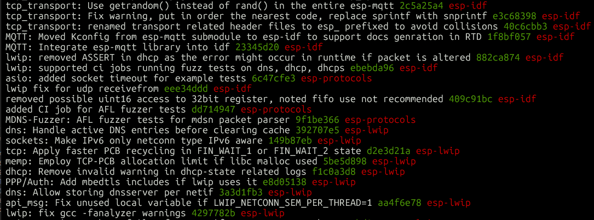

# Commit Summary by Area

Total deduplicated commits: **2025** (author or committer: cermak@espressif.com / david.cermak@espressif.com)

Repositories scanned: esp-idf (HEAD), esp-lwip (2.1.3-esp), esp-protocols (HEAD).

Duplicate titles across repos are deduplicated (preferring esp-lwip > esp-protocols > esp-idf).

## Commits per area

| Area | Commits | % |
|------|--------:|--:|
| lwIP / TCP/IP Stack | 240 | 11.9% |
| esp_netif / Network Interface | 147 | 7.3% |
| mDNS | 225 | 11.1% |
| MQTT / Mosquitto | 130 | 6.4% |
| Modem / PPP / Cellular | 260 | 12.8% |
| ASIO | 33 | 1.6% |
| WiFi Remote | 43 | 2.0% |
| EPPP (Ethernet over PPP) | 38 | 1.9% |
| Transport Layer (TCP Transport & WebSocket) | 76 | 3.8% |
| CI / Testing & Maintenance | 835 | 41.2% |
| **Total** | **2027** | **100%** |

Non-merge commits: **1581** · Merge commits: **446**

## lwIP / TCP/IP Stack (240 commits)

Core lwIP stack work: sockets, netconn, DHCP/DHCP server, DNS, IPv4/IPv6, SNTP, pbuf handling, and upstream lwIP porting in esp-lwip and esp-idf.

## esp_netif / Network Interface (147 commits)

esp_netif abstraction layer: interface lifecycle, SLIP, bridge, glue to lwIP, tcpip_adapter removal, custom/vanilla-lwip integration, and esp_eth drivers.

## mDNS (225 commits)

Multicast DNS: service discovery, hostname registration, custom netif support, socket-based API, fuzzing/CI for mdns component, and protocol fixes.

## MQTT / Mosquitto (130 commits)

MQTT client library and embedded Mosquitto broker component: connection handling, TLS, examples, and broker/client bug fixes.

## Modem / PPP / Cellular (260 commits)

esp_modem cellular drivers (SIM7600, BG96, etc.), PPP/CMUX/DTE-DCE layers, AT command handling, and modem examples.

## ASIO (33 commits)

Boost.Asio port for ESP-IDF: async socket I/O, SSL streams, executor integration, and compatibility with lwIP sockets.

## WiFi Remote (43 commits)

esp_wifi_remote component: remote WiFi control, RPC/host-target split, buffer management, and co-processor WiFi offload.

## EPPP (Ethernet over PPP) (38 commits)

EPPP tunneling over serial/PPP links: link setup, channel multiplexing, examples, and transport integration.

## Transport Layer (TCP Transport & WebSocket) (76 commits)

Higher-level transport abstractions: esp_tcp_transport (TLS, proxy, WS upgrade) and esp_websocket_client connection/reconnect logic.

## CI / Testing & Maintenance (835 commits)

CI pipelines, GitLab runners, fuzzer builds, example tests, version bumps, merge commits, build/Kconfig fixes, and general maintenance.

